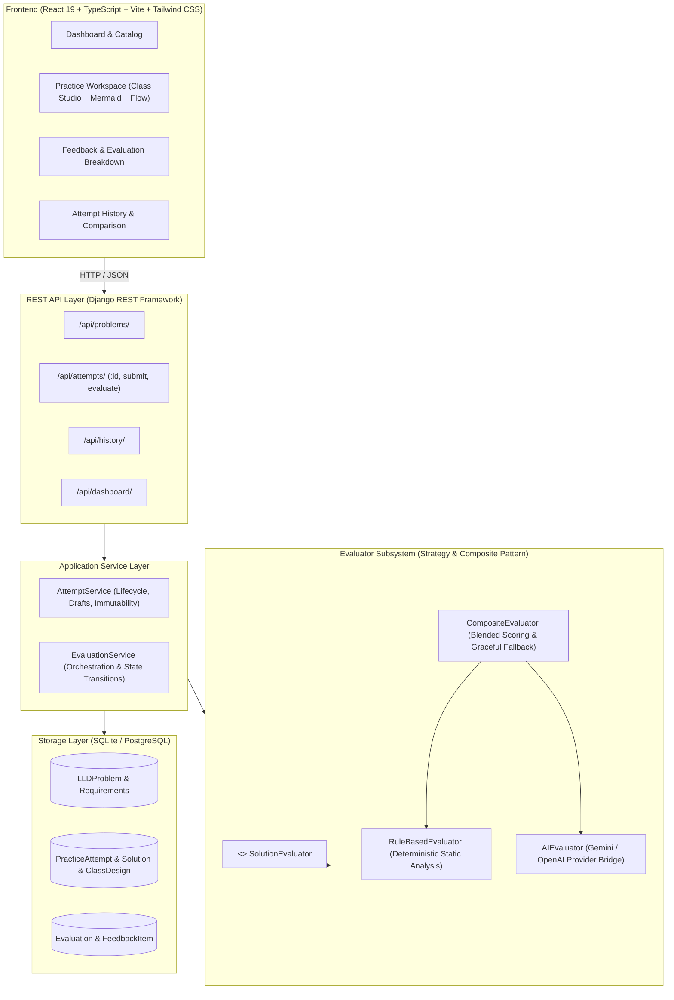
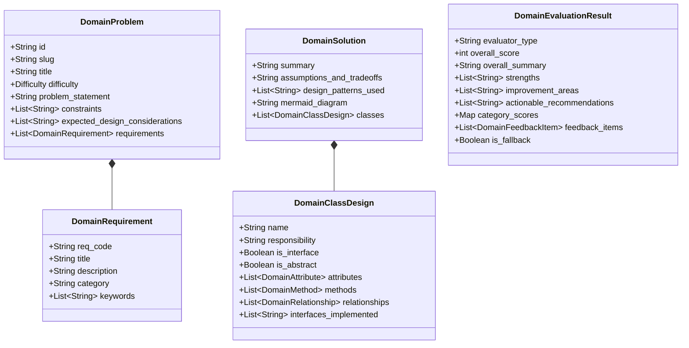
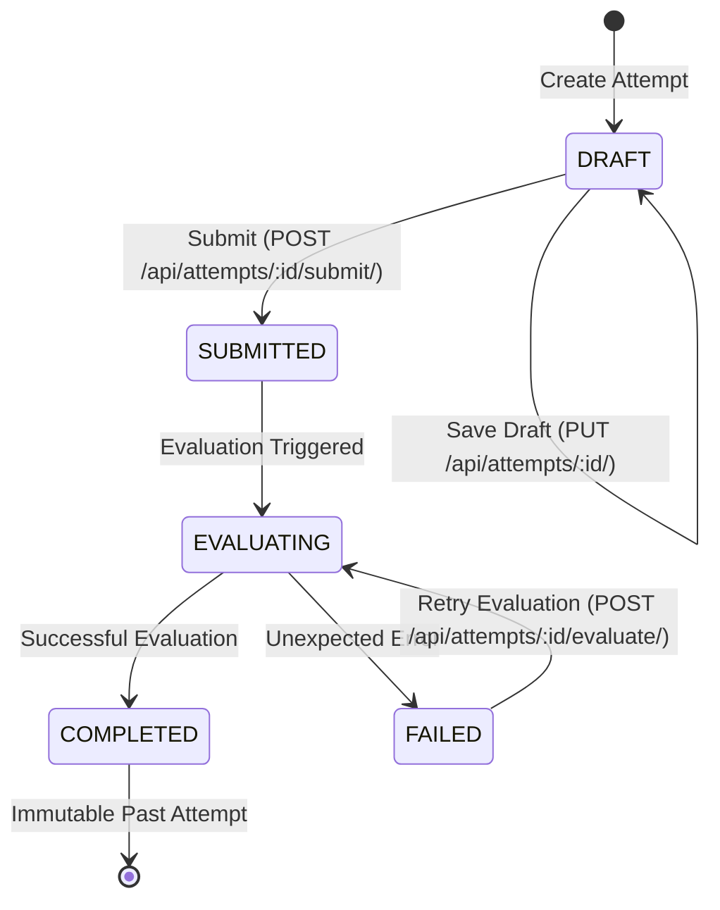

# DESIGN.md — LLD Practice Platform Architecture & Domain Design

## 1. System Overview & Architecture

The **LLD Practice Platform** is built as a clean, modular, and testable monolithic web application. It bridges the gap between passive LLD study and active engineering interview practice by combining structured object-oriented design authoring with explainable deterministic and AI-powered feedback.



---

## 2. The Core Learner Journey

```mermaid
sequenceDiagram
    autonumber
    actor Learner
    participant UI as React Frontend
    participant API as REST API / Services
    participant Eval as Evaluator Engine
    participant DB as Database

    Learner->>UI: Select LLD Problem (e.g. Parking Lot)
    UI->>API: GET /api/problems/parking-lot/
    API-->>UI: Return Requirements, Constraints & Hints
    
    Learner->>UI: Click "Start New Attempt"
    UI->>API: POST /api/attempts/ (problem_id)
    API->>DB: Create PracticeAttempt(status=DRAFT, attempt_number=N)
    API-->>UI: Return Attempt ID & Initial Solution Shell
    
    Learner->>UI: Define Classes, Responsibilities, Methods & Flow
    UI->>API: PUT /api/attempts/:id/ (Save Draft)
    API->>DB: Update Solution & ClassDesign records
    
    Learner->>UI: Click "Submit & Evaluate"
    UI->>API: POST /api/attempts/:id/submit/
    API->>API: Validate completeness (classes > 0, SRP non-empty, summary > 20 chars)
    API->>DB: Set status = SUBMITTED -> EVALUATING
    API->>Eval: Execute CompositeEvaluator(solution, problem)
    Eval->>Eval: 1. RuleBasedEvaluator (8 deterministic checks)
    Eval->>Eval: 2. AIEvaluator (LLM reasoning & qualitative review)
    Eval-->>API: DomainEvaluationResult
    API->>DB: Save Evaluation & FeedbackItem records; status = COMPLETED
    API-->>UI: Return Completed Attempt & Evaluation
    
    UI-->>Learner: Display Scores, Strengths, Growth Areas & Actionable Steps
    Learner->>UI: Click "Try Again"
    UI->>API: POST /api/attempts/ (creates Attempt #N+1 without mutating old attempt)
```

---

## 3. Domain Model Design

The core domain is structured around clean data classes and interfaces located in `backend/core/domain/`, decoupled from framework-specific ORM concerns.

### 3.1 Domain Entities



---

## 4. Evaluator Architecture (Strategy & Composite Pattern)

To ensure the platform never hardcodes vendor lock-in or breaks when AI credentials are absent, evaluation is built around the **Dependency Inversion Principle (DIP)**:

```python
class SolutionEvaluator(ABC):
    @abstractmethod
    def evaluate(self, solution: DomainSolution, problem: DomainProblem) -> DomainEvaluationResult:
        pass
```

### 4.1 Evaluation Implementations
1. **`RuleBasedEvaluator` (Deterministic Engine)**:
   - Evaluates 8 deterministic passes:
     - *Requirements Keyword & Semantic Mapping* (checks entity/method coverage against stated requirements).
     - *Single Responsibility Principle & God Class Detection* (identifies classes handling excessive methods or orthogonal domains).
     - *Abstraction & Interface Utilization* (verifies polymorphic contracts and interface implementation).
     - *SOLID Principles Compliance* (checks OCP, LSP, ISP, and DIP indicators).
     - *Coupling & Cohesion Analysis* (detects dangling class references where targets are missing).
     - *Design Pattern Verification* (validates claimed patterns against structural classes).
     - *Edge Cases & Concurrency Notes* (scans for race condition/locking considerations).
     - *Overall Architecture Explanation Clarity*.
2. **`AIEvaluator` (Qualitative Reasoning)**:
   - Provider-agnostic bridge supporting Google Gemini (`gemini-1.5-flash`) and OpenAI (`gpt-4o-mini`).
   - Sends structured prompt containing candidate classes, methods, relationships, diagram, and requirements.
   - Enforces strict JSON schema output mapping directly to `DomainEvaluationResult`.
3. **`CompositeEvaluator` (Hybrid Orchestrator)**:
   - Executes `RuleBasedEvaluator` for baseline ground truth.
   - Executes `AIEvaluator` inside a guarded try-except block.
   - Merges results (40% deterministic + 60% AI reasoning), deduplicates strengths and recommendations, and tags every finding with `DETERMINISTIC` or `AI_SUGGESTION`.
   - **Graceful Fallback**: If AI fails, times out, or has no API key, it seamlessly returns the deterministic result with `is_fallback=True`, ensuring learner work is never lost.

---

## 5. Attempt Lifecycle & Immutability

Practice attempts follow a strict state machine:



### Immutability Invariant
Once an attempt transitions out of `DRAFT`, any subsequent `PUT` or `PATCH` request to modify classes or solution text is rejected with HTTP 400 (`"Cannot modify attempt in SUBMITTED/COMPLETED state. Submitted attempts are immutable."`).

To practice again, the learner uses the **Try Again** action, which instantiates a new `PracticeAttempt` with `attempt_number = N + 1` for the same problem. This preserves historical learning progression.

---

## 6. Key Architectural Trade-offs

| Decision | Chosen Approach | Alternative Considered | Engineering Rationale |
| :--- | :--- | :--- | :--- |
| **Architecture Topology** | Modular Monolith | Microservices (Auth, Evaluator, Problems) | A focused 2-day MVP prioritized domain correctness, explainable feedback, and fast local development over distributed microservice complexity. |
| **Evaluator Concurrency** | Synchronous service execution with fast LLM timeouts (25s) | Celery / Redis asynchronous worker queue | Avoids heavy Redis/worker dependencies for local evaluation while keeping the service layer decoupled so workers can be introduced later with zero view changes. |
| **Class Diagram Representation** | Mermaid JS markdown rendering + auto-sync from structured classes | Drag-and-drop canvas (e.g. React Flow / Fabric.js) | Structured classes guarantee semantic data for static evaluation, while Mermaid provides immediate, code-like visualization without high canvas complexity. |
| **Data Normalization** | Relational `LLDProblem`, `PracticeAttempt`, `Solution`, `ClassDesign`, `Evaluation`, and `FeedbackItem` | Single JSON Document in MongoDB | Relational integrity ensures strong querying, cascading deletion of attempts, and precise feedback item categorization. |
