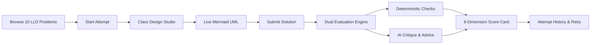

<div align="center">

# 🏗️ LLD Practice Platform

### *Interactive Low-Level Design (LLD) Mastery & Interview Preparation Platform*

Practice canonical object-oriented design problems, structure classes and responsibilities, visualize live Mermaid UML diagrams, and receive explainable deterministic & AI-assisted feedback across 9 design dimensions.

<br/>

[](https://react.dev/)
[](https://www.typescriptlang.org/)
[](https://vitejs.dev/)
[](https://tailwindcss.com/)
[](https://www.python.org/)
[](https://www.djangoproject.com/)
[](https://www.django-rest-framework.org/)
[](LICENSE)

<br/>

[🌟 Key Highlights](#-key-highlights) •
[🧩 10 Canonical Problems](#-10-canonical-lld-challenges) •
[🎨 Practice Studio](#-interactive-practice-studio) •
[🧠 Evaluation Engine](#-dual-layer-evaluation-engine) •
[🚀 Quick Start](#-quick-start-guide) •
[📡 API Reference](#-rest-api-reference)

---

</div>

## 🌟 Key Highlights

- 🔄 **End-to-End Learner Journey**: `Choose Problem` ➔ `Analyze Requirements` ➔ `Design Classes` ➔ `Generate UML` ➔ `Submit` ➔ `Deterministic & AI Evaluation` ➔ `Iterate & Improve`.
- 📐 **Interactive Class Design Studio**: Add and edit classes, define Single Responsibility Principle (SRP) contracts, specify typed methods and attributes, and model relationships (Inheritance, Implementation, Composition, Aggregation).
- 📊 **Real-time Mermaid UML Visualizer**: Generates instant, clean UML class diagrams with one-click **"Sync from Classes"** capability.
- 🎯 **Dual-Layer Explainable Feedback Engine**:
  - **Deterministic Rules Engine**: 8 automated static checks (Requirements Keyword Coverage, God Class Prevention, Polymorphism & Abstraction, Relationship Integrity, SOLID principles).
  - **AI Reasoning Layer (DeepSeek / Gemini / OpenAI)**: Context-aware qualitative critique, coupling analysis, and concrete architectural suggestions.
  - **Zero-Failure Fallback**: Automatically operates in deterministic mode if AI API keys are not supplied.
- 📈 **Attempt History & Progression Tracking**: Preserves past attempts, tracks score improvements, and supports iterative **"Try Again"** workflows.

---

## 🔁 Learner Workflow



---

## 🧩 10 Canonical LLD Challenges

Each problem comes pre-seeded with realistic interview requirements, edge cases, hints, and expected design patterns:

| # | Problem | Difficulty | Est. Time | Key Patterns & Concepts Tested |
| :---: | :--- | :---: | :---: | :--- |
| **01** | **Parking Lot System** | `🟡 Medium` | ~45 min | Strategy (Pricing/Allocation), Factory, Polymorphic Spot Sizing |
| **02** | **Elevator Control Bank** | `🔴 Hard` | ~60 min | State Machine, SCAN/LOOK Dispatcher Strategy, Observer |
| **03** | **Vending Machine System** | `🟢 Easy` | ~30 min | State Pattern, Optimal Coin Change Calculation, Inventory Lock |
| **04** | **Library Management** | `🟡 Medium` | ~45 min | Book vs BookItem Abstraction, FIFO Reservation, Fine Strategy |
| **05** | **Splitwise (Expense Sharing)** | `🟡 Medium` | ~45 min | Equal/Exact/Percent Splits, Debt Minimization Graph Algorithm |
| **06** | **Movie Ticket Booking** | `🔴 Hard` | ~60 min | Temporary Seat Locking with TTL, Concurrency, Dynamic Pricing |
| **07** | **Snake & Ladder Game** | `🟢 Easy` | ~30 min | Board Entity Polymorphism, Pluggable Dice Strategy, Turn Manager |
| **08** | **ATM System** | `🟡 Medium` | ~45 min | State Pattern Lifecycle, Chain of Responsibility Note Dispenser |
| **09** | **API Rate Limiter Library** | `🔴 Hard` | ~60 min | Token Bucket & Sliding Window Strategies, Atomic Concurrency |
| **10** | **Chess Game Engine** | `🔴 Hard` | ~60 min | Polymorphic Piece Rules, Command Pattern Move History, Checkmate |

---

## 🎨 Interactive Practice Studio

<table width="100%">
<tr>
<td width="50%" valign="top">

### 1. Class Design Studio
- Define class name, package, type (Class, Abstract Class, Interface).
- Add typed fields with visibility modifiers (`+public`, `-private`, `#protected`).
- Define methods with parameter signatures and return types.
- Set up relationships:
  - `--|>` Inheritance
  - `..|>` Interface Implementation
  - `*--` Composition
  - `o--` Aggregation

</td>
<td width="50%" valign="top">

### 2. Live Mermaid UML Studio
- Instant visualization of classes and relationships as an interactive SVG diagram.
- One-click **"Sync from Classes"** to auto-generate UML syntax.
- Real-time syntax error validation.
- Free-form architecture notes and Design Pattern tagging (Strategy, Factory, Observer, State, Command, etc.).

</td>
</tr>
</table>

---

## 🧠 Dual-Layer Evaluation Engine

The platform evaluates solutions across **9 core dimensions**:

```
 1. Requirements Coverage       6. Extensibility & Open-Closed
 2. God Class Prevention        7. Appropriate Design Patterns
 3. Polymorphism & Abstraction  8. Data Modeling Integrity
 4. Coupling & Cohesion         9. Edge Case Resilience
 5. SOLID Principles
```

### Deterministic vs. AI-Assisted Evaluation

```
┌─────────────────────────────────────────────────────────────┐
│                    Submission Evaluation                    │
└──────────────────────────────┬──────────────────────────────┘
                               │
               ┌───────────────┴───────────────┐
               ▼                               ▼
  ┌─────────────────────────┐     ┌─────────────────────────┐
  │  RuleBasedEvaluator     │     │  AIEvaluator            │
  │  (Static Analysis)      │     │  (DeepSeek/Gemini/GPT)  │
  ├─────────────────────────┤     ├─────────────────────────┤
  │ • Requirements keywords │     │ • Nuanced OOP critique  │
  │ • God class detection   │     │ • Coupling concerns     │
  │ • Abstract hierarchies  │     │ • Actionable next steps │
  │ • Relationship validity │     │ • Refactoring advice    │
  └────────────┬────────────┘     └────────────┬────────────┘
               │                               │
               └───────────────┬───────────────┘
                               ▼
  ┌─────────────────────────────────────────────────────────┐
  │              Consolidated Feedback Report               │
  │   - Weighted Score (0 - 100)                            │
  │   - 9-Dimension Breakdown                               │
  │   - Strengths & Key Areas for Growth                    │
  │   - Specific, Line-by-Line Actionable Recommendations   │
  └─────────────────────────────────────────────────────────┘
```

---

## 🛠️ Tech Stack & Architecture

| Layer | Technology | Details |
| :--- | :--- | :--- |
| **Frontend** | React 19 + TypeScript | High-performance modern UI with typed state management |
| **Styling** | Tailwind CSS v4 | Clean dark/light modern developer aesthetic |
| **Diagrams** | Mermaid.js | Live client-side UML rendering |
| **Backend** | Python 3.13 + Django 6 | Clean Architecture with Domain, Service, and API separation |
| **API** | Django REST Framework | RESTful endpoints with full serialization and validation |
| **Evaluators** | Extensible Evaluator Pattern | `RuleBasedEvaluator`, `AIEvaluator`, `CompositeEvaluator` |
| **Testing** | Pytest + Pytest-Django | Comprehensive unit, service, and API integration test suite |

---

## 🚀 Quick Start Guide

### Prerequisites
- **Python**: `3.10` or higher
- **Node.js**: `18.x` or higher
- **npm**: `9.x` or higher

---

### 1. Clone & Setup Repository

```bash
git clone https://github.com/ffhfgfh/LLD-Practice-Platform.git
cd LLD-Practice-Platform
```

---

### 2. Backend Setup (Django)

```bash
# Navigate to backend directory
cd backend

# Create virtual environment
python -m venv venv

# Activate virtual environment
# Windows:
.\venv\Scripts\activate
# macOS/Linux:
# source venv/bin/activate

# Install dependencies
pip install -r requirements.txt

# Run migrations and seed the 10 canonical LLD problems
python manage.py makemigrations core
python manage.py migrate
python manage.py seed_data

# Start Django development server (default: http://127.0.0.1:8000)
python manage.py runserver
```

---

### 3. Frontend Setup (React + Vite)

In a new terminal window:

```bash
# Navigate to frontend directory
cd frontend

# Install npm packages
npm install

# Start Vite development server (default: http://localhost:5173)
npm run dev
```

Open [http://localhost:5173](http://localhost:5173) in your browser.

---

### 4. Optional: Environment Configuration

Copy `.env.example` to `.env` in the root or `backend/` directory:

```env
# Django Settings
SECRET_KEY=your-django-secret-key
DEBUG=True

# Evaluator Provider: 'composite' (default), 'rule_based', 'deepseek', 'gemini', 'openai'
EVALUATOR_TYPE=composite

# AI Provider Keys (Optional: Leave empty for 100% deterministic evaluation)
DEEPSEEK_API_KEY=your_deepseek_api_key_here
GEMINI_API_KEY=your_gemini_api_key_here
OPENAI_API_KEY=your_openai_api_key_here
```

---

## 🧪 Running Automated Tests

```bash
# Run backend test suite with Pytest
cd backend
pytest -v

# Run frontend build check
cd ../frontend
npm run build
```

---

## 📡 REST API Reference

| Method | Endpoint | Description |
| :--- | :--- | :--- |
| `GET` | `/api/dashboard/` | Learner progress summary, stats, and recommended problems |
| `GET` | `/api/problems/` | List all 10 problems (filter by `?difficulty=` or `?search=`) |
| `GET` | `/api/problems/:id/` | Detailed requirements, constraints, hints, and diagrams |
| `POST` | `/api/attempts/` | Initialize a new practice attempt (`{"problem_id": "<id>"}`) |
| `GET` | `/api/attempts/:id/` | Fetch current attempt state, draft solution, and classes |
| `PUT` | `/api/attempts/:id/` | Auto-save draft classes, diagram, and architectural notes |
| `POST` | `/api/attempts/:id/submit/` | Submit solution and execute evaluation pipeline |
| `GET` | `/api/evaluations/:id/` | Get evaluation report, 9-category scores, and recommendations |
| `GET` | `/api/history/` | View past attempt history grouped by problem |

---

## 📂 Project Structure

```
LLD-Practice-Platform/
├── backend/
│   ├── lld_platform/          # Django project settings & URL configuration
│   ├── core/
│   │   ├── domain/            # Pure domain layer (Dataclasses, Enums, Interfaces)
│   │   │   ├── enums.py       # Difficulty, AttemptStatus, EvaluationCategory
│   │   │   ├── models.py      # DomainProblem, DomainSolution, DomainClass
│   │   │   └── interfaces.py  # SolutionEvaluator interface
│   │   ├── models.py          # Django ORM models
│   │   ├── serializers.py     # DRF serializers
│   │   ├── views.py           # REST API ViewSets & endpoints
│   │   ├── urls.py            # API routing
│   │   ├── services/          # Business logic & orchestrators
│   │   │   ├── attempt_service.py     # Attempt state & immutability lifecycle
│   │   │   ├── evaluation_service.py  # Evaluation pipeline runner
│   │   │   └── evaluators/            # Pluggable evaluator strategies
│   │   │       ├── rule_based.py      # Deterministic 8-pass static analyzer
│   │   │       ├── ai_evaluator.py    # DeepSeek / Gemini / OpenAI adapter
│   │   │       ├── composite_evaluator.py
│   │   │       └── factory.py
│   │   ├── management/commands/
│   │   │   └── seed_data.py   # Seeder for 10 complete LLD challenges
│   │   └── tests/             # Automated test suite (API, services, evaluators)
│   ├── manage.py
│   └── requirements.txt
├── frontend/
│   ├── src/
│   │   ├── components/
│   │   │   ├── common/        # Badge, Button, Card, Spinner, ErrorAlert, StatCard
│   │   │   ├── layout/        # Navbar, Footer, Layout wrapper
│   │   │   ├── problems/      # ProblemCard, RequirementsList, Details
│   │   │   ├── practice/      # ClassCard, ClassEditorModal, MermaidViewer, ArchitectureEditor
│   │   │   ├── evaluation/    # ScoreCard, CategoryScores, Strengths, FeedbackList
│   │   │   └── history/       # AttemptHistoryCard, AttemptComparisonModal
│   │   ├── pages/             # Dashboard, Problems, Practice, Feedback, History
│   │   ├── services/api.ts    # Axios REST API client
│   │   ├── types/index.ts     # TypeScript domain definitions
│   │   ├── App.tsx
│   │   └── main.tsx
│   ├── package.json
│   └── vite.config.ts
├── .env.example
├── .gitignore
├── DESIGN.md
├── RESEARCH.md
├── AI_USAGE.md
└── README.md
```

---

## 🤝 Contributing & License

Contributions, problem additions, and feedback are always welcome!
Feel free to open an [Issue](https://github.com/ffhfgfh/LLD-Practice-Platform/issues) or submit a [Pull Request](https://github.com/ffhfgfh/LLD-Practice-Platform/pulls).

Distributed under the **MIT License**. See `LICENSE` for more information.

<div align="center">
  <sub>Built with ❤️ for software engineers mastering Object-Oriented & Low-Level Design.</sub>
</div>